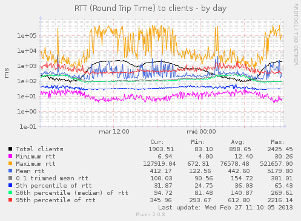
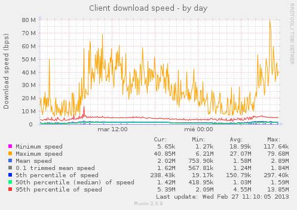

This is a quick'n'dirty munin plugin to graph the download speed and RTT to
clients connecting to port :http (80) and not being localhost as measured by ss
utility of iproute2.

The command being executed is:
```bash
 ss -i -t 'sport = :http and not dst 127.0.0.1 and not dst [::1]'
```

Its output is parsed to graph the download speed of the clients reported by the
kernel and the RTT (Roud Trip Time) and RTTVar (Round Trip Time Variance) of
the clients connected to port 80 (http).

If this plugin is used in a machine with lots of connections some options in
the kernel have a very big impact in the speed of execution of the ss utility,
you should consider enabling (or loading the modules) of these options:

``` 
 INET: socket monitoring interface (INET_DIAG)

 CONFIG_INET_DIAG:

 Support for INET (TCP, DCCP, etc) socket monitoring interface used by
 native Linux tools such as ss. ss is included in iproute2
```
```
 UNIX: socket monitoring interface (UNIX_DIAG)

 CONFIG_UNIX_DIAG:

 Support for UNIX socket monitoring interface used by the ss tool.
```
```
 UDP: socket monitoring interface (INET_UDP_DIAG)

 CONFIG_INET_UDP_DIAG:

 Support for UDP socket monitoring interface used by the ss tool.
```
```
 Packet: sockets monitoring interface (PACKET_DIAG)

 CONFIG_PACKET_DIAG:

 Support for PF_PACKET sockets monitoring interface used by the ss tool.
```
As we are only asking ss for TCP stats perhaps just INET_DIAG / 
tcp_diag.ko is needed.


Some sample output:





Jorge Nerín <jnerin@gmail.com>
